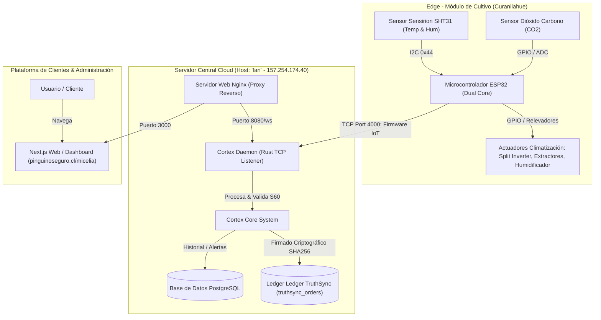
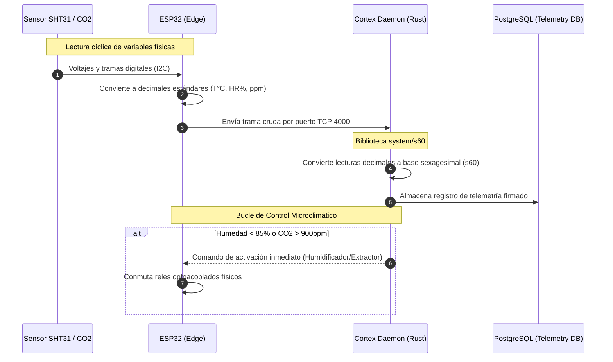
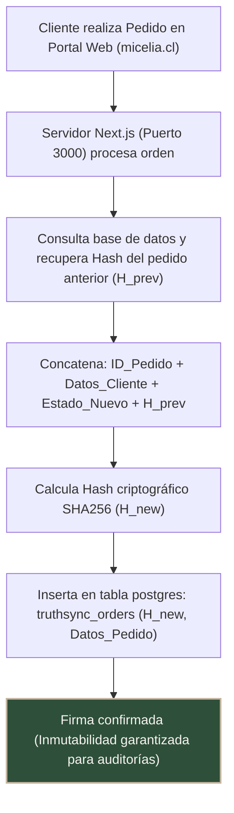
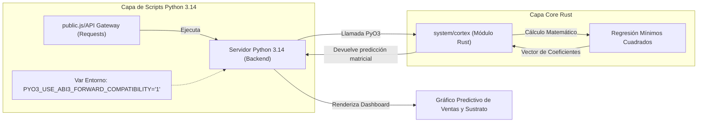
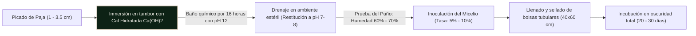

# Dossier Técnico y de Arquitectura: Proyecto Micelia
### Postulación Sercotec - Capital Abeja Emprende 2026 (Provincia de Arauco, Región del Biobío)

Este documento recopila la especificación de ingeniería, la arquitectura de sistemas, los diagramas de flujo y las métricas operativas de **Micelia**. Está diseñado para servir como el respaldo técnico formal para el evaluador del Comité de Evaluación Regional (CER) de Sercotec.

---

## 1. Ficha Resumen del Proyecto

| Parámetro | Detalle Técnico |
| :--- | :--- |
| **Postulante** | María Angélica Sepúlveda Carrasco |
| **Ubicación** | Comuna de Curanilahue, Provincia de Arauco, Región del Biobío |
| **Giro Comercial** | Producción, cultivo técnico y venta de Hongo Ostra (*Pleurotus ostreatus*) |
| **Superficie de Cámara**| Módulo térmico controlado de 30 m² |
| **Modelo Financiero** | Subsidio Sercotec Neto: \$3.500.000 | Aporte Propio: \$105.000 | IVA: \$684.950 | Total: \$4.289.950 |
| **Punto de Equilibrio** | \$221.000 CLP/mes (Equivalente al 21.2% de los ingresos en régimen de \$1.040.000) |

---

## 2. Arquitectura General del Sistema IoT e Infraestructura

El sistema opera bajo un esquema híbrido de computación física (Edge Computing) y servicios en la nube para automatizar la climatización de la sala de fructificación de 30 m².

---

## 3. Telemetría y Climatización: Estándar Yatra S60

Toda la lectura de los sensores climáticos es capturada por el firmware del ESP32 local, procesada en base sexagesimal mediante la librería interna `s60` en el Cortex daemon, y analizada en función de los rangos ideales fúngicos óptimos.

### Rangos Críticos Destacados para Pleurotus ostreatus
* **Humedad Relativa**: 85% - 95% (Crítico para inducir la formación de primordios).
* **Concentración de $CO_2$**: < 900 ppm (Previene la formación de tallos elongados y estériles).
* **Temperatura**: 18°C - 22°C (Crecimiento celular equilibrado).

---

## 4. Ledger de Transacciones TruthSync: Flujo Criptográfico Inmutable

Para dar máxima transparencia comercial y auditar la trazabilidad de los pedidos (vital para canales de venta B2B HORECA), cada pedido nuevo y actualización de despacho es firmado en el ledger criptográfico mediante un hash SHA256 inmutable que enlaza el historial transaccional.

---

## 5. Módulo Predictivo de Ventas: Rust PyO3 y Python 3.14

Para proyectar el inventario de paja de trigo y la demanda de producción, Micelia cuenta con un motor matemático de regresión lineal (mínimos cuadrados) programado en Rust para alto rendimiento (`system/cortex/src/lib.rs`), expuesto a Python usando PyO3 para integración flexible en el backend.

---

## 6. Proceso Agroindustrial: Inmersión Alcalina

El tratamiento del sustrato lignocelulósico (paja de trigo picada) se realiza de forma sustentable mediante **inmersión alcalina** para evitar el gasto energético térmico (leña/gas) de la pasteurización convencional por vapor.

---

> [!NOTE]  
> **Ventajas de la Inmersión Alcalina**: Al usar hidróxido de calcio a temperatura ambiente se destruyen las esporas de mohos competidores (como *Trichoderma*) por deshidratación osmótica. Esto reduce a cero el consumo de combustibles, optimizando la viabilidad financiera del proyecto y reduciendo los costos variables del sustrato.

> [!TIP]  
> **Validación del Sustrato (Prueba del Puño)**: Al apretar el sustrato tratado con la mano enguantada, debe mojar la mano sin gotear excesivamente. Si gotea como chorro, falta drenaje; si no moja, falta humedad.

---
*Dossier técnico desarrollado por el equipo de ingeniería de Micelia para la postulación Capital Abeja Emprende 2026 de Sercotec, Región del Biobío.*
