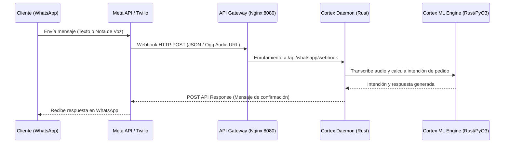

# Manual de Integración Técnica de Micelia

Este documento detalla la arquitectura de integración para trasladar las simulaciones del bot de WhatsApp, el pasaporte de cosecha (QR) y el planificador Cortex ML de desarrollo al entorno real de producción.

---

## 1. Integración del Bot de WhatsApp en Producción

Actualmente, el portal de desarrollo cuenta con un **Simulador Conversacional Web** interactivo. Para conectarlo a una línea real de WhatsApp Business, se debe seguir esta arquitectura:



### Pasos de Implementación:
1. **Configurar Webhook**: Registrar la URL `https://micelia.cl/ws` (o `/api/whatsapp` según configures) como webhook de entrada en la consola de desarrolladores de Meta (o Twilio).
2. **Procesar Notas de Voz**: 
   * Meta envía notas de voz en formato `.ogg`. 
   * Se requiere usar una librería de decodificación como `ffmpeg` (o el decodificador nativo de Rust `symphonia`) para transcribir el archivo antes de pasarlo al procesador Cortex.
3. **Registro de Pedidos**: Cuando la intención del bot es una orden válida, Cortex interactúa directamente con el módulo de base de datos PostgreSQL para registrar el pedido y firmarlo en el Ledger TruthSync.

---

## 2. Ledger de Transacciones TruthSync (PostgreSQL)

Todo pedido y cambio de estado de despacho se firma criptográficamente mediante SHA-256 en la tabla `truthsync_orders`.

### Esquema de Base de Datos Sugerido:
```sql
CREATE TABLE truthsync_orders (
    id SERIAL PRIMARY KEY,
    order_id VARCHAR(50) NOT NULL UNIQUE,
    customer_name VARCHAR(100) NOT NULL,
    customer_email VARCHAR(100) NOT NULL,
    items TEXT NOT NULL,
    total_amount INTEGER NOT NULL,
    status VARCHAR(30) DEFAULT 'Pendiente',
    previous_hash VARCHAR(64) DEFAULT '0000000000000000000000000000000000000000000000000000000000000000',
    block_hash VARCHAR(64) NOT NULL,
    created_at TIMESTAMP DEFAULT CURRENT_TIMESTAMP
);
```

### Algoritmo de Firmado SHA-256 (Rust):
```rust
use sha2::{Sha256, Digest};

pub fn calculate_block_hash(
    order_id: &str,
    customer_name: &str,
    items: &str,
    total_amount: i32,
    previous_hash: &str
) -> String {
    let mut hasher = Sha256::new();
    let data = format!(
        "{}-{}-{}-{}-{}",
        order_id, customer_name, items, total_amount, previous_hash
    );
    hasher.update(data.as_bytes());
    format!("{:x}", hasher.finalize())
}
```

---

## 3. Pasaporte de Cosecha (Trazabilidad QR)

El visualizador [view_lote.html](system/dashboard/view_lote.html) recibe el ID del lote por parámetro de URL.

### Generación de Códigos QR Físicos:
1. Al confirmarse un pedido, se genera una etiqueta adhesiva para la caja de setas con el código de barras y un QR.
2. El QR codifica la URL de trazabilidad:
   `https://micelia.cl/micelia/view_lote.html?lote=M260717-A`
3. Al ser escaneado por el cliente o chef del restaurante, el portal carga en tiempo real la bitácora desde la tabla de telemetría de producción y la firma criptográfica asociada.

---

## 4. Telemetría IoT (Yatra S60)

Toda lectura de sensores (Temperatura, Humedad, CO₂) se almacena internamente en formato sexagesimal (`s60`) en la base de datos PostgreSQL, garantizando el estándar Yatra S60 de Micelia.

### Rangos Críticos para Visualización Premium:
* **Humedad**: 85% - 95%. Crítico para evitar el secado de los primordios de setas.
* **CO₂**: < 900 ppm. Si sube de este límite, el hongo ostra crece con tallo largo fibroso y sombrero deforme.
* **Temperatura**: 18°C - 22°C. Rango celular óptimo para la asimilación enzimática de la celulosa del sustrato.
