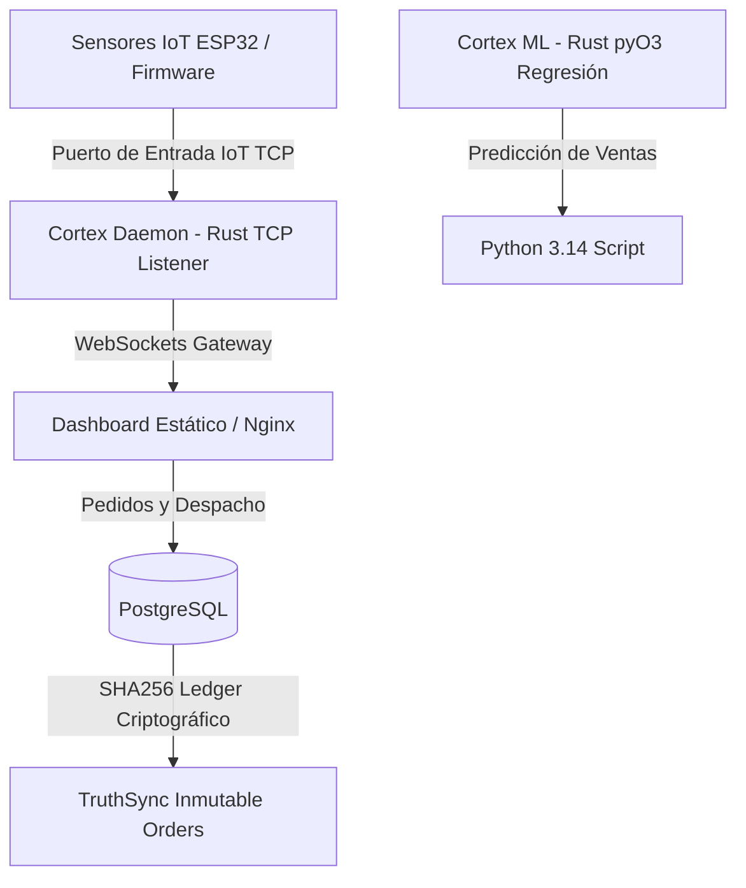

# Micelia - Plataforma Tecnológica Fúngica Sostenible

Micelia es una plataforma integral de fungicultura y monitoreo IoT de precisión orientada a potenciar la soberanía alimentaria, la economía circular y la biotransformación en la Provincia de Arauco, Región del Biobío, Chile. 

Este repositorio alberga el backend de telemetría, el daemon de sincronización IoT, el portal de administración del catálogo comercial y la **Biblioteca Científica Micelia**.

---

## 🚀 Arquitectura y Componentes Técnicos



### 1. Cortex Daemon (`system/cortex/`)
* **Tecnología**: Escrito en **Rust**.
* **TCP Listener**: Recibe y decodifica las ráfagas de telemetría enviadas por el firmware de las salas de cultivo.
* **API Gateway & WebSockets**: Canaliza en tiempo real los datos de temperatura y humedad a los navegadores del cliente.
* **Integración ML**: Modelos matemáticos de regresión por mínimos cuadrados expuestos mediante **PyO3** para predicción de ventas bajo Python 3.14. Requiere la variable de entorno `PYO3_USE_ABI3_FORWARD_COMPATIBILITY = "1"`.

### 2. Estándar de Telemetría Yatra S60
* Toda lectura de sensores (Temperatura, Humedad, CO₂) se procesa en base sexagesimal (`s60`) en la biblioteca interna `system/s60/`.
* **Rangos Fúngicos Ideales**:
  * **Humedad**: 85% - 95% (crítico para inducción de primordios).
  * **CO₂**: < 900 ppm (previene deformaciones o elongaciones fibrosas en el pie de las setas).
  * **Temperatura**: 18°C - 22°C (crecimiento celular equilibrado).

### 3. Ledger TruthSync
* Registro inmutable de transacciones alojado en PostgreSQL en la tabla `truthsync_orders`.
* Cada inserción calcula el hash criptográfico SHA256 enlazando el ID del pedido, datos del cliente, estado anterior y el nuevo estado de despacho.

### 4. Biblioteca Micelia (`system/dashboard/`)
Catálogo de divulgación científica, culinaria, tecnológica y sustentable del hongo ostra (*Pleurotus ostreatus*):
* **Filtros**: Alimentación, Ciencia, Cultivo, Sostenibilidad, Tecnología y Recetas.
* **Flujo de Accesibilidad (Adulto Mayor)**: Integración directa con WhatsApp para pedidos rápidos del Pack Adulto Mayor 500g ($4.500 CLP) con redirección al número corporativo con mensaje pre-redactado.

---

## 🌐 Configuración del Servidor y Enrutamiento (Conceptual)

La plataforma utiliza el enrutamiento reverso de Nginx para distribuir la carga del sistema de forma segura:
* **/ (Raíz)** ➔ Redirección al frontend dinámico (puerto Next.js interno).
* **/portfolio** ➔ Directorio de portafolio y recursos estáticos.
* **/micelia** ➔ Directorio del dashboard de control fúngico y biblioteca científica.
* **/ws** ➔ Canal de WebSockets conectado directamente al daemon IoT de Rust.

Las políticas de seguridad del sistema y el cortafuegos están configurados para permitir únicamente conexiones necesarias para los servicios expuestos, restringiendo el acceso administrativo directo a través de llaves criptográficas seguras.

---

## 🛠️ Comandos de Despliegue

Para desplegar de forma segura los cambios locales al servidor remoto, ejecute el comando de sincronización automatizado:

```bash
make -C system deploy
```

Este comando sincroniza los estáticos del dashboard de Micelia y recompila el daemon Cortex en la arquitectura de producción mediante reglas preestablecidas.

---

## 🤖 Indexación por IAs y Rastreadores

El proyecto incluye configuraciones para facilitar la indexación automática y lectura estructurada por parte de asistentes de IA (GPTBot, ClaudeBot, Google-Extended, etc.):
* **robots.txt**: Localizado en la carpeta pública del sitio web, permitiendo el rastreo del catálogo científico a bots de inteligencia artificial.
* **SEO Semántico**: El HTML5 del dashboard y los archivos Markdown (`docs/*.md`) emplean estructuras limpias y estandarizadas de fácil extracción para la generación de conocimiento.
